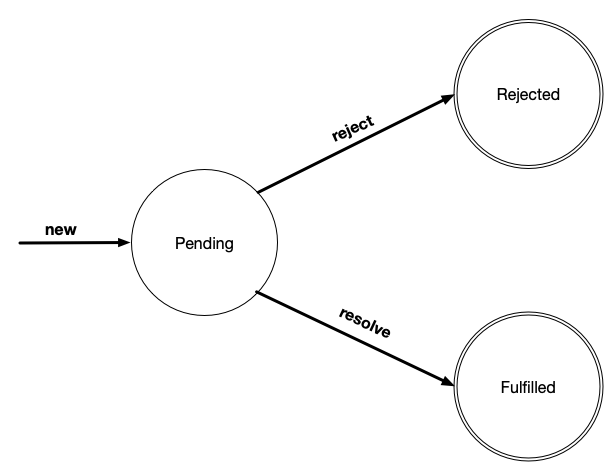
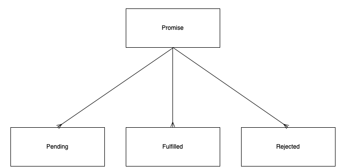
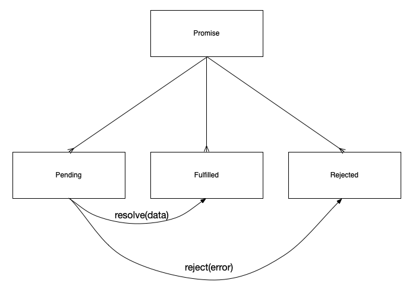

[](https://badge.fury.io/js/%40microstates%2Funion) [](https://bundlephobia.com/result?p=@microstates/union) [](https://circleci.com/gh/microstates/union)

## @microstates/union

Model state machines using disjoint union types.

### The equilavance between state machines and disjoint union types.

What makes a state machine so useful is that it must always be in
_exactly one_ of a set of discreet states. For example, consider the
following state diagram for a machine that models the states of a Promise.



A promise starts in the `Pending` state, and then, it either moves to
the `Resolved`, or the `Fulfilled` state. But however it ends up, at
any given point in time it _must_ be one of those three states.

Union types (also called `enum` types in languages like [Java][1] and
[TypeScript][2]) have this exact same property. While they all
represent a single abstract data type, each particular _value_ that
you hold a reference to must be an instance of exactly one concrete
subtype.

If we were to imagine a type hiearchy that implemented a scheme like
this, it would look something akin to the following with an abstract
superclass of `Promise` that has three concrete constructors
`Pending`, `Fulfilled`, and `Rejected`:



We can never instantiate an instance of `Promise` directly, but instead must
always hold a reference to exactly _one_ of its subtypes. Just like a
state machine! In fact, you can model _any_ state machine as a union type, where
there is exactly one concrete constructor for each discreet state in
the state machine.

Furthermore, you can model each state transition from one state to
another as a _method_ on the type representing the first state that
_returns_  an instance of the type representing the second.

Let's pencil in those methods representing these state transitions
into our type hierarchy.



As you can see, the `Pending` type has two methods, `resolve()` and
`reject()`. The `resolve()` method returns an instance of `Fulfilled`,
and then `reject()` method returns an instance of `Rejected`.

Notice how it's impossible to transition from `Fulfilled` to
`Rejected` or from `Fulfilled` to `Pending` because there is no method
to do so.

### Using a `Union`

You can assemble hiearchies like this on your own, but given how
common it is to model state machines with types, `@microstates/union`
provides the `Union` helper to assemble it quickly for you.

The `Union` function takes a set of `name: Function` pairs and returns
the abstract union type, where the `name` is the name of the state,
and `Function` is a function that takes the abstract superclass as a
parameter and returns a subclass that extends that superclass.

We can use it to define our promise type hierarchy.

``` javascript
import Union from '@microstates/union';

const PromiseType = Union({
  Pending: PromiseType => class extends PromiseType {},
  Resolved: PromiseType => class extends PromiseType {},
  Rejected: PromiseType => class extends PromiseType {}
});

```

The abstract type will have all of its concrete types attached to it


``` javascript
typeof PromiseType.Pending //=> 'function'
PromiseType.Pending.prototype instanceof PromiseType //=> true

typeof PromiseType.Fulfilled //=> 'function'
PromiseType.Fulfilled.prototype instanceof PromiseType //=> true

typeof PromiseType.Rejected //=> 'function'
PromiseType.Rejected.prototype instanceof PromiseType //=> true
```

You can instantiate a member of the union using the static `create`
method. Every member has boolean properties to help you determine what
kind of state it is:

``` javascript
let pending = PromiseType.Pending.create();
pending instanceof PromiseType //=> true
pending instanceof PromiseType.Pending //=> true
pending.isPending //=> true
pending.isRejected //=> false
pending.isFulfilled //=> false
```

Anything passed to the create method will be used as the `state`
property of the microstate

``` javascript
let fulfilled = PromiseType.Fulfilled.create('result');
fulfilled.isPending //=> false
fulfilled.isFulfilled //=> true

fulfilled.state //=> 'result';
```

In order to add transition methods to a member, just add them to its
class declaration. Here's how we'd add the `resolve()` and `reject()`
method. Every union type has a private `to[Member]` helper method to
help you transition between states.

``` javascript
import Union from '@microstates/union';

const PromiseType = Union({
  Pending: PromiseType => class extends PromiseType {
    reject(reason) {
      return this.toRejected(reason);
    },
    resolve(result) {
      return this.toFulfilled(result);
    }
  },
  Resolved: PromiseType => class extends PromiseType {},
  Rejected: PromiseType => class extends PromiseType {}
});

let pending = PromiseType.Pending.create();

let fulfilled = pending.resolve('here is some data');
fulfilled.isFulfilled //=> true
fulfilled.state //=> 'here is some data'
```

### Serialization of Union Types

Internally, the value of a union type is stored as a `{ type, value }`
object which can be confusing since it does not correspond to the
normal way in which microstate values are stored internally. However,
storing this type internally is necessary since a microstate tree must
always be computable from its value.

``` javascript
import { valueOf } from 'microstates';

let fulfilled = PromiseType.FulFilled.create('data');
valueOf(fulfilled) //=> { type: "Fulfilled", value: "data" }
```

In order to deserialize a union type, you should pass the `{ type,
value }` combination:

``` javascript
let rejected = create(PromiseType, { type: "Rejected", value: new Error('something went wrong!')});

rejected.isRejected //=> true
rejected instanceof PromiseType.Rejected //=> true
rejected.state //=> Error { "something went wrong!" }
```

[1]: https://en.wikipedia.org/wiki/Enumerated_type#Java
[2]: https://en.wikipedia.org/wiki/Enumerated_type#TypeScript
